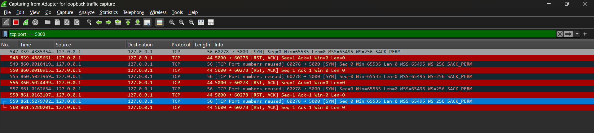
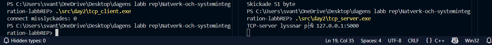
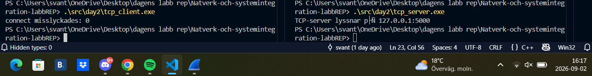
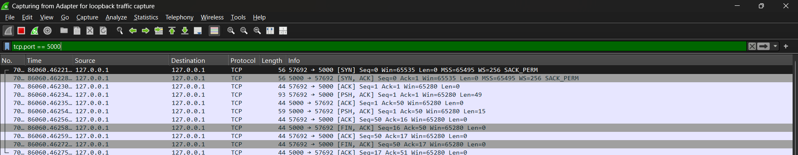
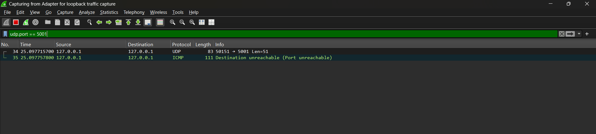
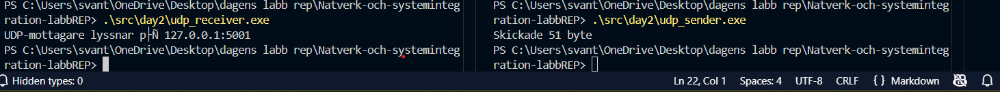
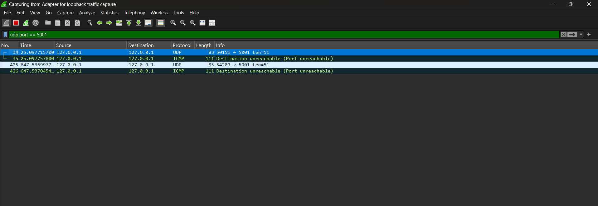
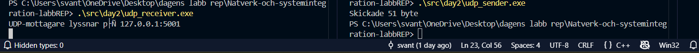
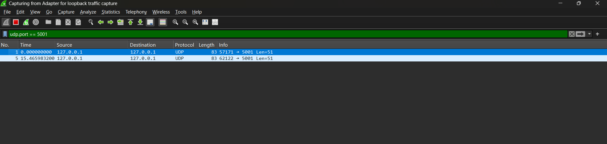

# git-recap
detta reposetory är för alla labbar
day2

tcp och udp tester

TCP:
--
 wireshark
 terminal
^^testade med att använda fel port på klienten då misslyckades kommandot^^
--

^^testade med att inte ha servern på när man kör klient kommandot då misslyckades det också^^
----
wireshark

Man kan se JSON meddelandet som skickades från klienten i den fjärde columnen och man kan se JSON statusmeddelandet från servern i en sjätte columnen

UDP:
--
 wireshark
 terminal
^^testade att skicka iväg JSON meddelandet innan mottagaren var på och den verka skicka meddelandet men den säger att destinationen är unreachable^^
--
 wireshark
 terminal
^^testade att skicka iväg JSON meddelandet till en mottagare som letar efter en annan port det verkade skicka men den sa det i wireshark att destinationen är unreachable^^
----
wireshark

udp skickar JSON meddelandet i en package